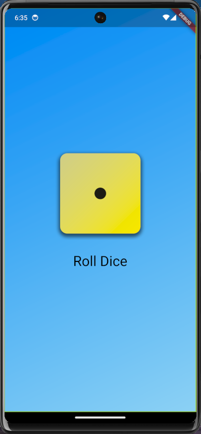

# roll_dice_app

The Roll Dice app offers users a straightforward yet interactive experience. By pressing the 'Roll Dice' button, the application employs a random number generator to produce a result between one and six. The user is then presented with a visual representation of the dice roll through dynamically displayed images on the screen. This tactile and visually engaging feature enhances user interaction with the app, adding an element of excitement and unpredictability to the experience. The user interface design, as illustrated in the figure below, serves as a visual guide, offering a glimpse into the aesthetic and layout of the application. This combination of functionality and design ensures that users can easily navigate and enjoy the key feature of the Roll Dice app.

